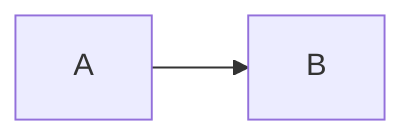

# Jainish Patel — Research Studio

A personal website that is three things at once:

1. **A portfolio**: your projects, research, experience and story.
2. **A publication**: a real blog where readers can like, save, share and comment.
3. **A control room** (`/admin`): where you write posts and edit everything on the site, **without touching any code**.

Everything runs on your own computer with a small built-in database. You don't need to sign up for any online service, and you don't need to be a programmer to run it.

> **In one sentence:** install Node.js once, double-click `start.bat` (Windows) or `start.command` (Mac), and the site opens in your browser.

---

## Contents

1. [What you need](#1-what-you-need)
2. [Step-by-step setup (first time only)](#2-step-by-step-setup-first-time-only)
3. [Starting and stopping the site every day](#3-starting-and-stopping-the-site-every-day)
4. [Your first ten minutes in the admin](#4-your-first-ten-minutes-in-the-admin)
5. [Making the site yours](#5-making-the-site-yours)
6. [Backing up your work](#6-backing-up-your-work)
7. [Troubleshooting](#7-troubleshooting)
8. [Optional extras: GitHub and Spotify](#8-optional-extras-github-and-spotify)
9. [Putting the site on the internet](#9-putting-the-site-on-the-internet)
10. [Glossary](#10-glossary)
11. [Technical reference (for developers)](#11-technical-reference-for-developers)

---

## 1. What you need

| You need | Why | Cost |
| --- | --- | --- |
| A Windows, Mac or Linux computer | It runs the site | — |
| **Node.js, version 22.12 or newer** | The engine that runs the site | Free |
| An internet connection (first time only) | To download the site's building blocks | — |
| About 1.5 GB of free disk space and about 10 minutes | The downloaded building blocks are large | — |

You do **not** need Git, a database, an account anywhere, or any programming knowledge.

---

## 2. Step-by-step setup (first time only)

### Step 1 — Install Node.js

1. Go to **https://nodejs.org**.
2. Click the big green button labelled **LTS** (it says "Recommended for most users"). The version number must be **22 or higher**.
3. Open the file you downloaded and click **Next** through the installer. Keep all the default choices.
4. **Restart your computer**, or at least close every terminal window. A terminal that was already open will not notice the new Node.js.

**Check that it worked.** Open a terminal:
- **Windows:** press the Windows key, type `cmd`, press Enter.
- **Mac:** press `⌘ Space`, type `Terminal`, press Enter.

Type this and press Enter:

```
node -v
```

You should see something like `v22.12.0` or higher. If you see a lower number (for example `v20.16.0`), the old Node.js is still active. See [Troubleshooting](#7-troubleshooting).

### Step 2 — Get the files

**Easiest way (no Git needed):**
1. Open this project's page on GitHub.
2. Click the green **Code** button, then **Download ZIP**.
3. Unzip it somewhere easy to find, such as your Desktop. You should end up with a folder called `jainish1510.github.io` (or similar) that contains `package.json`, `start.bat` and `README.md`.

> **Which version?** The new site lives on the branch named `main` once its pull request is merged. Until then, switch the branch dropdown on GitHub to `claude/confident-cori-pavlcb` *before* clicking Download ZIP.

**If you already use Git:**
```
git clone https://github.com/jainish1510/jainish1510.github.io.git
cd jainish1510.github.io
```

### Step 3 — Start it

Pick **one** of these:

**A. Double-click (easiest)**
- **Windows:** double-click **`start.bat`**.
- **Mac:** double-click **`start.command`**. The first time, macOS may say it can't be opened because it is from an unidentified developer. Right-click the file, choose **Open**, then **Open** again.

**B. Type it yourself**
1. Open a terminal *inside the project folder*:
   - **Windows:** open the folder in File Explorer, click the address bar at the top, type `cmd` and press Enter.
   - **Mac:** right-click the folder and choose *New Terminal at Folder* (or drag the folder onto the Terminal icon).
2. Run these two commands, one after the other:
   ```
   npm install
   npm run dev
   ```

**What happens the first time** (this is automatic, so you don't have to do anything):

1. `npm install` downloads the site's building blocks. It takes **2–5 minutes**, and it is normal for it to print a lot of text.
2. `npm run dev` then:
   - creates a private settings file called `.env` with random secret keys,
   - creates the database (`data/portfolio.db`),
   - fills it with starter content (sample articles, projects, your CV details),
   - and starts the site.
3. You will see a **box with your admin login**, like this:

```
  ┌────────────────────────────────────────────────────┐
  │ YOUR ADMIN LOGIN  (shown once — save it)           │
  │                                                    │
  │ Address:   http://localhost:3000/admin             │
  │ Email:     admin@example.com                       │
  │ Password:  XA0aTFxhLjAc                            │
  └────────────────────────────────────────────────────┘
```

**Copy the password somewhere safe.** If you lose it, it is also saved in the `.env` file (open it with Notepad), or you can [set a new one](#i-forgot-my-admin-password).

### Step 4 — Open the site

Wait until you see `Ready` in the terminal, then open your browser at:

- **The website:** http://localhost:3000
- **The admin area:** http://localhost:3000/admin (sign in with the email and password from the box)

`localhost` means "this computer". Nobody else on the internet can see the site yet. Only you can, on this machine.

---

## 3. Starting and stopping the site every day

| I want to… | Do this |
| --- | --- |
| **Start** the site | Double-click `start.bat` / `start.command`, or run `npm run dev` in the project folder |
| **Stop** the site | Click the terminal window and press **Ctrl + C** (then `Y` and Enter if Windows asks). Closing the window also works. |
| **See** the site | Browser → http://localhost:3000 |
| **Write or edit** | Browser → http://localhost:3000/admin |

Starting again takes a few seconds. Your content is kept between runs.

The site only works while that terminal window is open. If you close it, the site stops (this is normal).

---

## 4. Your first ten minutes in the admin

Go to http://localhost:3000/admin and sign in. Here is the left-hand menu:

| Menu item | What it is for |
| --- | --- |
| **Dashboard** | A summary: views, drafts, comments waiting for you |
| **Posts** | All your blog posts (published, drafts, archived) |
| **Comments** | Approve or reject what readers write |
| **Media** | Your uploaded pictures and videos |
| **Tags & categories** | Organise posts |
| **Analytics** | Which posts are read, and where visitors come from |
| **Messages** | Notes sent through the Contact page |
| **Projects, Research, Experience, Skills** | Your portfolio entries |
| **Personal content** | The "Currently" block, your journey timeline, books, interests, goals, social links |
| **Widgets** | Switch the Spotify, GitHub, clock and fact boxes on or off |
| **Site settings** | Your name, headline, About text, contact email, menu links |

### Write and publish your first post

1. Click **New post** (the white button at the top left, or press **C**).
2. Type a **title** and a **subtitle** at the top.
3. Write in the big box below. Use the toolbar for headings, bold, links, lists, code, equations, tables, images and videos. You can also **paste or drag a picture** straight into the text and it uploads for you.
4. The right half of the screen shows the **live preview** of what readers will see. Use the buttons at the top (**Write / Split / Preview**) to switch layouts.
5. Open the **settings panel** (the icon at the top right) to choose a **category**, add **tags**, pick a **cover image** and write a short **excerpt**.
6. Your work **saves itself** as a draft every few seconds. You can also press **Ctrl + S** (**⌘ S** on Mac).
7. When you are happy, click **Publish**. A small checklist appears. Click **Publish now**.
8. Click **View** in the green message that appears. Your post is live on the site.

### Add a picture or video
- In a post: click the picture icon in the toolbar, or paste or drag the file in.
- Or go to **Media** → **Upload**. Afterwards, click a file and fill in the **alt text** (a short description for people who can't see the image). It improves accessibility and search results.
- Allowed types: PNG, JPEG, WebP, GIF, AVIF, MP4, WebM. Maximum 12 MB each.
- For YouTube, use the film icon in the toolbar and paste the video's link.

### Moderate comments
Comments from readers are **not shown publicly until you approve them.**
1. Go to **Comments**. The **Pending** tab holds new ones.
2. Click **Approve**, **Reject** or **Spam** on each. You can tick several and act on them together.
3. Click **Reply** to answer as the author. Replying approves the comment you answer.

### Change what visitors see on the home page
- **Name, headline and the one-line intro:** Site settings → *Identity* and *Homepage*.
- **The "Currently" box** (studying, building, learning, location): Personal content → *Currently*.
- **Hide a section of the home page:** Site settings → *Homepage* → switch it off.

### Change your admin password
Open a terminal in the project folder and run (put your own password in the quotes; it must be at least 12 characters):
```
npm run admin:password -- "my new long password"
```

---

## 5. Making the site yours

The starter content is built from the CV details that were in this project. Anything that could not be known is **clearly marked** so that nothing false is shown as fact.

**Find the placeholders and replace them:**

| What you will see | Where to change it |
| --- | --- |
| Badges saying **"details pending"** on a project | Admin → Projects → open the project → fill in the sections → untick *"Mark as details pending"* |
| Research marked **"placeholder"** | Admin → Research |
| `[Placeholder]` text (for example in goals or availability) | Admin → Personal content → *Goals*, or Site settings → *Contact* |
| The portrait box labelled **"placeholder"** on the About page | Admin → Media → upload a photo, set its folder to **profile** |
| Sample articles labelled **"demonstration content"** | Admin → Posts → edit or delete them, and write your own |
| Comments from readers named **"(demo)"**, and the sample view numbers | Delete them in Admin → Comments, or reset without them (see below) |
| Project links (GitHub / live demo) that are empty | Admin → Projects |

**Start over with a clean slate and no demo comments, likes or views:**
```
npm run db:seed -- --no-demo
```
> ⚠️ This **replaces all content** with the starter content. Don't run it after you've written your own posts unless you have [a backup](#6-backing-up-your-work).

---

## 6. Backing up your work

Everything you create lives in **one folder: `data`** inside the project folder.

- `data/portfolio.db`: all posts, comments, settings and content
- `data/uploads/`: all the images and videos you uploaded

**To back up:** stop the site, then copy the whole `data` folder somewhere safe (USB drive, cloud storage). Do this regularly, and always before experimenting.

**To restore:** stop the site, replace the `data` folder with your backup, start again.

Also keep a copy of the `.env` file somewhere private. It holds your secrets. Don't share it or upload it anywhere public.

---

## 7. Troubleshooting

### `node -v` shows a number lower than 22 (for example v20.16.0)
Your computer is still using an old Node.js.
1. Install the **LTS** version from https://nodejs.org (it must say 22 or higher).
2. **Close every terminal window** and open a new one. Run `node -v` again.
3. Still old? Another copy is first in your system's path. Uninstall the old Node.js (Windows: *Settings → Apps*), then reinstall the new one. If you use `nvm`: `nvm install 22` then `nvm use 22`.
4. After upgrading, **delete the `node_modules` folder** and run `npm install` again. The database driver is built for one specific Node version, so an old copy won't work.

### `npm install` prints a wall of yellow `EBADENGINE` warnings, or stops with an error mentioning "engine"
Same cause as above: Node.js is too old. The project deliberately stops early so you get a clear message instead of a half-working site.

### "`npm` is not recognized" / "command not found"
Node.js isn't installed, or you didn't restart the terminal after installing. See Step 1.

### "Port 3000 is already in use"
Something else (often a previous run of this site) is using that port.
- Close other terminal windows running the site, then try again.
- Or use another port: `npm run dev -- -p 3001` and visit http://localhost:3001.

### I forgot my admin password
Run this in the project folder (any password of 12+ characters):
```
npm run admin:password -- "my new long password"
```
Your original generated one is also written in the `.env` file under `ADMIN_PASSWORD` (only until you change it).

### The email in the admin login is `admin@example.com`. Can I change it?
Yes. Before the **very first** start, create a file called `.env` (copy `.env.example`), set `ADMIN_EMAIL="you@yourmail.com"` and `ADMIN_NAME="Your Name"`, save it, then start. After the first start, use *Admin → Site settings* for display details; the login email is set when the database is created. To redo it, see "Start completely fresh" below.

### Windows says "running scripts is disabled" (PowerShell)
Use **Command Prompt** (`cmd`) instead of PowerShell, or double-click `start.bat`.

### Windows Firewall / antivirus asks about "Node.js"
Click **Allow** for *private networks*. The site only needs to talk to your own computer.

### The page is blank, or looks broken, right after starting
The first page load after starting compiles the site and can take 10–20 seconds. Wait and refresh. If it still fails, stop the site (Ctrl + C) and start it again.

### Pictures I uploaded are missing
Make sure the `data/uploads` folder is still there. Uploads live there, not in the database.

### The GitHub or Spotify box says "Currently unavailable"
That's expected without internet access or the optional keys. The rest of the site keeps working. See [Optional extras](#8-optional-extras-github-and-spotify).

### Start completely fresh (this deletes everything you wrote!)
1. Stop the site (Ctrl + C).
2. Delete the `data` folder and the `.env` file.
3. Start again. A new `.env`, database and starter content are created, with a new admin password shown in the box.

### Something else
Copy the **whole** error text from the terminal. The last 20 lines are the most useful. That is what anyone helping you will need.

---

## 8. Optional extras: GitHub and Spotify

The site works fully without these. Open `.env` in Notepad (Windows) or TextEdit (Mac). It is in the project folder, and may be hidden because its name starts with a dot. Then add the values you want, save, and restart the site.

**GitHub activity on the About page**
- Works automatically with your public profile (`GITHUB_USERNAME`, default `jainish1510`).
- For the full contribution calendar, create a token at github.com → *Settings → Developer settings → Personal access tokens*. It needs **no permissions**. Paste it as `GITHUB_TOKEN="…"`.

**Spotify "now playing"**
Without keys, the box shows a clearly labelled **demo track** that you choose in *Admin → Widgets*. To show what you're really listening to:
1. Create an app at https://developer.spotify.com/dashboard and note its **Client ID** and **Client Secret**.
2. Authorise it once with the scopes `user-read-currently-playing user-read-recently-played`, and obtain a **refresh token**.
3. Put all three in `.env` as `SPOTIFY_CLIENT_ID`, `SPOTIFY_CLIENT_SECRET`, `SPOTIFY_REFRESH_TOKEN`.

---

## 9. Putting the site on the internet

Running on your own computer (`localhost`) is private. To let the world see it:

> ⚠️ **GitHub Pages cannot host this site.** This repository used to be a GitHub Pages site, but the new site has a database and an admin area, which need a real server. A static host such as GitHub Pages can only show fixed files.

Good options (all need a **persistent disk** so your database and uploads survive restarts):

- A small **VPS** (DigitalOcean, Hetzner, Linode)
- **Fly.io** (with a volume), **Railway**, or **Render** (with a disk)

On the server, with Node 22.12+ installed:

```bash
npm ci
cp .env.example .env
#   edit .env:
#     NEXT_PUBLIC_SITE_URL="https://your-domain.com"
#     SESSION_SECRET="<64 random characters>"
#     ADMIN_EMAIL, ADMIN_PASSWORD (12+ characters)
npm run build
npm start          # creates the database on first run, then serves on port 3000
```

Put it behind HTTPS (most hosts do this for you). Back up the `data` folder regularly. Before going live, delete the demo posts and comments (Admin) or run `npm run db:seed -- --no-demo` once on a fresh server.

---

## 10. Glossary

| Word | Plain meaning |
| --- | --- |
| **Terminal / command line** | A window where you type commands. Called *Command Prompt* on Windows and *Terminal* on Mac. |
| **Node.js** | The free engine that runs the site. Installed once. |
| **npm** | Comes with Node.js. It downloads the building blocks (`npm install`) and runs commands (`npm run …`). |
| **localhost** | "This computer". `http://localhost:3000` is the site running on your machine. |
| **Admin** | The private area at `/admin` where you edit everything. |
| **Draft / Published / Archived** | A draft is private; published is public; archived is hidden but kept. |
| **Slug** | The part of a post's web address, for example `my-first-post` in `/blog/my-first-post`. |
| **Markdown** | A simple way to format text (`## Heading`, `**bold**`). The toolbar writes it for you. |
| **`.env` file** | A private settings file with secrets. Never share it. |
| **Database** | The file `data/portfolio.db` where all your content is stored. |
| **Alt text** | A short description of an image for people using screen readers. |

---

## 11. Technical reference (for developers)

### Commands

| Command | What it does |
| --- | --- |
| `npm run dev` | Start the dev server. **`predev` runs `scripts/ensure-setup.mjs` first**: checks Node ≥ 22.12, creates `.env` with random secrets, runs migrations, seeds a brand-new database. Idempotent and quiet when nothing needs doing. |
| `npm run build` / `npm start` | Production build / server (`prestart` runs the same setup check) |
| `npm run setup` | Explicit migrate → generate → seed |
| `npm run admin:password -- "…"` | Change the admin password only |
| `npm run db:migrate` | `prisma migrate dev` after editing `schema.prisma` |
| `npm run db:deploy` | Apply existing migrations |
| `npm run db:generate` | Regenerate the Prisma client into `src/generated/prisma` |
| `npm run db:seed [-- --no-demo]` | Wipe content tables and reseed (refuses in production without `--force`) |
| `npm run db:studio` | Browse the SQLite file with Prisma Studio |
| `npm run db:reset` | Drop, migrate, reseed (development only) |
| `npm run typecheck` | `tsc --noEmit` |
| `npm test` | Vitest unit and integration tests (fresh SQLite at `data/test.db`) |
| `npm run test:e2e` | Playwright end-to-end tests (isolated `data/e2e.db`, port 3100) |

`.npmrc` sets `engine-strict=true`, so installing on an unsupported Node fails fast with a clear message.

### Dependency policy
All dependencies are on their latest stable releases (Next.js 16, React 19.3, Prisma 7.10, Tailwind 4, TypeScript 7, Vitest 5, Playwright 1.63, Three.js, Motion, Recharts, Mermaid). The one deliberate exception is Prisma: the registry's `latest` tag currently points at an 8.0 *release candidate*, so the project stays on the newest stable 7.x. Check with `npm outdated`.

### Environment variables

| Variable | Required | Purpose |
| --- | --- | --- |
| `DATABASE_URL` | yes (default set) | SQLite file, default `file:./data/portfolio.db` |
| `NEXT_PUBLIC_SITE_URL` | in production | Canonical origin for SEO, sitemap, RSS and OpenGraph |
| `SESSION_SECRET` | production (≥ 32 chars) | Signs anonymous visitor IDs, salts IP hashes. Generated automatically in development. |
| `ADMIN_EMAIL`, `ADMIN_PASSWORD`, `ADMIN_NAME` | first run | Admin account bootstrap (password ≥ 12 chars) |
| `GITHUB_USERNAME`, `GITHUB_TOKEN` | optional | GitHub widget |
| `SPOTIFY_CLIENT_ID`, `SPOTIFY_CLIENT_SECRET`, `SPOTIFY_REFRESH_TOKEN` | optional | Live "now playing" |
| `UPLOAD_DIR` | optional | Upload location, default `data/uploads` |

No credentials are committed. `.env` and `data/` are git-ignored.

### Public site
| Route | |
| --- | --- |
| `/` | WebGL constellation hero (mouse parallax, scroll dolly, reduced-motion and no-WebGL SVG fallback), "Currently", featured projects, research, writing, about, contact |
| `/about` | Story, journey timeline, education, experience, recognition, interests, goals, widgets (Spotify, GitHub, clock, random fact, learning, orbiting tools) |
| `/projects`, `/projects/[slug]` | Filterable explorer with depth-on-hover cards; detail pages with problem, architecture (Mermaid), how it works, challenges, results, lessons, gallery, demo |
| `/research`, `/research/[slug]` | Interactive force-directed research graph and academic-style entries |
| `/experience` | Scroll-driven timeline and technology universe |
| `/blog`, `/blog/[slug]` | Publication index and the reading experience: progress bar, table of contents, continue-reading, engagement bar, KaTeX, highlighted code, lightbox, embeds, Mermaid, interactive components, related posts, threaded comments |
| `/search`, `/bookmarks`, `/contact` | Search (also `⌘K` / `Ctrl K`), saved articles, contact form |
| `/rss.xml`, `/sitemap.xml`, `/robots.txt` | Feeds and SEO |

### Writing syntax
Posts are stored as Markdown (with extensions) in SQLite.

````markdown
## Headings, **bold**, *italic*, ++underline++, `code`, [links](https://…)

Inline math $E = mc^2$ and display math:

$$
\mathcal{L} = \mathbb{E}_{q}[\log p(x \mid z)] - D_{KL}(q \,\|\, p)
$$

```python
print("syntax highlighted, with a copy button")
```




:::gallery


:::

::youtube[Caption]{id="aircAruvnKk"}
::video[Caption]{src="/media/blog/clip.mp4"}
::embed[Caption]{url="https://codepen.io/user/pen/abc"}

:::callout{kind="note" title="Heads up"}
Callouts: note, tip, warning, demo.
:::

::component[Optional title]{name="gaussian-explorer" mu="1.2"}
````

Interactive components are registered in `src/components/content/component-slot.tsx` and are code-split. Bundled: `gaussian-explorer`, `sorting-visualizer`, `line-chart`, `uncertainty-sim`.

### Architecture
```
prisma/            schema.prisma, migrations/, seed.ts, seed-art.ts, seed-content/*.md
scripts/           ensure-setup.mjs (auto first-run setup), set-admin-password.ts
src/
  app/(public)/    public routes
  app/admin/       login, (panel)/ protected pages, actions/ (server actions)
  app/api/         route handlers (search, engagement, comments, uploads, health…)
  app/media/       serves uploads with range requests and a sandboxed CSP
  components/      ui, blog, content, portfolio, research, three, widgets, admin, interaction
  lib/db           Prisma client (the only SQLite-specific file)
  lib/repositories data access (Repository pattern)
  lib/integrations GitHub and Spotify adapters (Adapter pattern; Spotify has a demo provider)
  lib/content      Markdown pipeline, directives, embed factory, editor operations
  lib/search       in-process weighted search index
  lib/events       typed event bus (Observer): publish → revalidate pages, refresh search
  lib/admin        declarative collection definitions → generated validators and forms (Factory)
  lib/security     rate limiting, visitor IDs, spam scoring, request helpers
tests/             unit, integration, e2e
```
Strategy pattern: `render-strategy.ts` picks full / lite / static 3D quality per device.

**Moving off SQLite:** change `provider` in `schema.prisma`, swap `@prisma/adapter-better-sqlite3` for `@prisma/adapter-pg` / `@prisma/adapter-libsql` in `src/lib/db/client.ts`, regenerate migrations, and move uploads to object storage behind `src/lib/media/storage.ts`.

### Security
- **Admin auth:** scrypt hashing; opaque random session tokens in an `httpOnly`, `SameSite=Lax` cookie (Secure in production), only the SHA-256 stored; 7-day expiry; login rate-limited in memory and in the database.
- **Authorization:** `src/proxy.ts` gives an early redirect; `requireAdmin()` is the real check on every admin page, server action and admin route.
- **CSRF:** Server Actions use Next.js's origin check; JSON endpoints verify `Origin` against `Host`.
- **XSS:** Markdown is sanitized with `rehype-sanitize` before KaTeX and highlighting, raw HTML is never parsed, comments are plain text, Mermaid runs in strict mode, JSON-LD escapes `<`.
- **Uploads:** magic-byte type detection (no SVG), 12 MB cap, random filenames, traversal refused, served with `nosniff` and a sandboxed CSP.
- **Abuse controls:** per-IP rate limits; comment honeypot, time-to-submit, length limits, spam scoring, moderation queue.
- **Privacy:** HMAC-signed anonymous visitor cookie, salted IP hashes, referrer hostnames only, bots excluded from view counts.
- **Headers:** CSP, `X-Content-Type-Options`, `Referrer-Policy`, `X-Frame-Options`, `Permissions-Policy`, HSTS in production; admin pages `noindex`.

`npm audit` reports advisories in `mysql2`, a transitive dependency of the Prisma CLI. It is development tooling that this app never loads (SQLite only).

### Testing
- **Unit:** Markdown pipeline (XSS, math, directives, TOC), embeds, search, validation, collection-schema factory, editor operations, password hashing, visitor IDs, rate limiting, spam, upload detection, path traversal
- **Integration (real SQLite):** posts (create, edit, publish, schedule, archive, revisions, tags, slugs, related), likes (including concurrent duplicates), view de-duplication, bookmarks, comments (moderation, depth cap), sessions, collections, settings, media upload
- **E2E (Playwright):** login → create post → toolbar and live preview → tags and category → save draft → draft is a real 404 → full preview → publish → public article → like persists → save → comment → moderate → visible → bookmarks → search → logout; plus public smoke tests on desktop and mobile viewports

If Playwright's browser download is blocked, use an installed Chromium: `PW_CHROMIUM_PATH=/path/to/chrome npm run test:e2e`.

### Content provenance
- **Real profile data** (education, roles, projects, recognitions, links) comes from the CV data that was in this repository before the rebuild. Specific claims such as "5K+ scans" or "ROUGE +21%" are copied from that source.
- Anything not in that source is marked ("details pending", "placeholder", `[Placeholder]`).
- The five blog posts, "(demo)" commenters, and seeded likes, views and bookmarks are **demonstration content**, labelled as such. No publications, awards or employment were invented.

### Small delights
`⌘K` / `Ctrl K` command palette · `/` search · `?` keyboard shortcuts · `G` then `H/A/P/R/B/E/S` to navigate · `T` toggles the theme · type `sudo` in the palette for developer mode · try the Konami code · every cover image is generated from code.
