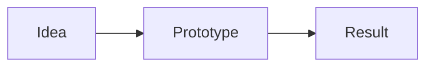

# Jainish Patel — Research Studio

A personal website: portfolio, research lab, interactive biography and a blog. It is a **static website**, which means it is just a folder of ready-made pages. That is why it can be hosted **for free on GitHub Pages**, with no server, no database and nothing to keep running.

**How you update it:** you edit simple text files in this repository (a blog post is one file). When you save your change on GitHub, GitHub rebuilds the site and publishes it automatically, usually in about two minutes.

> **In one sentence:** write or change a text file on github.com, click **Commit**, and your website updates itself.

---

## Contents

1. [How it works](#1-how-it-works)
2. [One-time setup: turn the website on](#2-one-time-setup-turn-the-website-on)
3. [Everyday editing in the browser (no installs)](#3-everyday-editing-in-the-browser-no-installs)
4. [Writing a blog post](#4-writing-a-blog-post)
5. [Pictures and videos](#5-pictures-and-videos)
6. [Editing the rest of the site](#6-editing-the-rest-of-the-site)
7. [Replace the placeholders](#7-replace-the-placeholders)
8. [Previewing on your own computer (optional)](#8-previewing-on-your-own-computer-optional)
9. [Optional extras](#9-optional-extras)
10. [Troubleshooting](#10-troubleshooting)
11. [What changed from the earlier version](#11-what-changed-from-the-earlier-version)
12. [Glossary](#12-glossary)
13. [Technical reference (for developers)](#13-technical-reference-for-developers)

---

## 1. How it works

```
 you edit a text file on github.com
              │  click "Commit"
              ▼
 GitHub Actions (free robot) checks your content, builds the site
              │  about 2 minutes
              ▼
 https://jainish1510.github.io  is updated
```

- **Your content lives in the `content` folder**: posts, projects, research, your bio, links. All plain text.
- **Your images live in `public/media`.**
- **Nothing else needs touching.** The design and code are in `src`, and you never have to open it.
- **The robot protects you.** If you make a typo in a content file, the robot refuses to publish and tells you exactly which file and line to fix. The old version of your site stays live in the meantime. A typo can't break your website.

---

## 2. One-time setup: turn the website on

You only do this once. You need a free GitHub account that owns this repository.

**Step 1: Get the new site onto the `main` branch.**
The new version is in a *pull request* (a proposed change). Open the repository on github.com, click the **Pull requests** tab, open the one that adds the static site, scroll down and click **Merge pull request**, then **Confirm merge**.

**Step 2: Tell GitHub to publish with Actions.**
1. In the repository, click **Settings** (the gear tab at the top).
2. In the left menu, click **Pages**.
3. Under **Build and deployment → Source**, choose **GitHub Actions**. (It may currently say *Deploy from a branch*. Change it.)

**Step 3: Wait for the first publish.**
1. Click the **Actions** tab. You'll see a job named **Deploy to GitHub Pages** running (yellow dot). It takes 2–4 minutes.
2. When it shows a green tick, your site is live at **https://jainish1510.github.io**.

If it shows a red cross, click it and open the failed step. The message says which content file has a problem (see [Troubleshooting](#10-troubleshooting)).

That's it. From now on, every change you commit to `main` is published automatically.

---

## 3. Everyday editing in the browser (no installs)

You can do everything from github.com, even on a phone or a library computer.

**To change an existing file**
1. Go to the repository's main page and click into the folder (for example `content` → `posts`).
2. Click the file you want, then click the **pencil icon** (✏️ *Edit this file*) at the top right.
3. Make your change.
4. Click the green **Commit changes…** button, then **Commit changes** again in the box that appears.
5. Wait about 2 minutes, then refresh your website. (Check the **Actions** tab if you want to watch it.)

**To add a new file**
1. Open the folder where it belongs (for example `content/posts`).
2. Click **Add file → Create new file**.
3. Type the file name at the top (for example `my-first-post.md`), paste or type the content, and click **Commit changes…**.

**To upload pictures**
1. Open the folder (for example `public/media/blog`).
2. Click **Add file → Upload files**, drag your pictures in, and click **Commit changes**.

**To undo a mistake:** open the file, click **History**, find an earlier version, and copy its text back. GitHub keeps every version forever, so nothing is ever really lost.

---

## 4. Writing a blog post

Each post is **one file** in `content/posts/`. The file name becomes the web address: `content/posts/my-first-post.md` appears at `…/blog/my-first-post/`.

**File names must be lowercase words joined with hyphens**, with no spaces or capitals, and end in `.md`.

### The easiest way: copy a template

Create a new file in `content/posts/`, for example `what-i-learned-this-week.md`, and paste this:

```markdown
---
title: What I learned this week
subtitle: One line that makes people want to read it
date: 2026-10-15
status: published
category: notes
tags:
  - Learning
  - Research
---

Write your post here. This is a normal paragraph.

## A heading

Text with **bold**, *italic* and a [link](https://example.com).

- a list
- of things
```

The block at the top, between the two lines of `---`, holds the post's settings. Everything below it is the post itself.

### The settings at the top

| Setting | Required? | What it does |
| --- | --- | --- |
| `title` | yes | The headline |
| `subtitle` | no | A line under the headline |
| `date` | yes (for published posts) | Written `YYYY-MM-DD`. Posts dated in the future stay hidden until that day. |
| `status` | no | `published` (default), `draft` (hidden), or `archived` (hidden) |
| `category` | no | One of the names in `content/categories.yml` (currently `research-notes`, `building`, `essays`) |
| `tags` | no | A list of topics, each on its own line starting with a dash |
| `featured` | no | `true` puts it in the big spot on the blog page |
| `cover` | no | A picture, e.g. `/media/blog/my-cover.png` (see [Pictures](#5-pictures-and-videos)). Without one, a pretty generated cover is used. |
| `coverAlt` | no | A short description of the cover for screen-reader users |
| `excerpt` | no | A short summary. If you leave it out, one is made from the first paragraph. |
| `areas` | no | Links the post to the research map, e.g. `[machine-learning, uncertainty]` (see `content/areas.yml`) |
| `demo` | no | `true` shows a "demonstration content" label |
| `seoTitle`, `seoDescription` | no | What Google shows, if different from the title and summary |

### Drafts and scheduling
- **Keep it private while you write:** set `status: draft`. It won't appear anywhere on the site.
- **Publish it:** change to `status: published` and commit.
- **Schedule it:** set `status: published` and a future `date`. The site rebuilds every morning, so it appears on that date automatically.

### Formatting cheat sheet (Markdown)

| You type | You get |
| --- | --- |
| `## Heading` and `### Smaller heading` | Headings. The table of contents is built from these. |
| `**bold**` and `*italic*` and `++underline++` | **bold**, *italic*, underline |
| `` `code` `` | `inline code` |
| `[text](https://address)` | A link |
| `- item` or `1. item` | Bulleted or numbered list |
| `> a quote` | A quotation |
| `---` | A divider line |
| A table, written with `\|` and `---` | A table (see below) |

```markdown
| Name | Score |
| --- | --- |
| Alice | 10 |
| Bob | 12 |
```

### Special blocks

**Maths** (LaTeX): `$E = mc^2$` inline, or on its own lines:

```
$$
\int_0^1 x \, dx = \tfrac{1}{2}
$$
```

**Code with colours and a copy button:**

````
```python
print("hello")
```
````

**Diagrams** (Mermaid):

````

````

**Video from YouTube / Vimeo / CodePen:**

```
::youtube[A caption]{id="aircAruvnKk"}
::embed[A caption]{url="https://codepen.io/user/pen/abc"}
```

(For YouTube, the `id` is the part after `v=` in the video's address.)

**A video file you uploaded:** `::video[A caption]{src="/media/blog/clip.mp4"}`

**A highlighted note:**

```
:::callout{kind="tip" title="Good to know"}
Kinds you can use: note, tip, warning.
:::
```

**An image gallery:**

```
:::gallery


:::
```

**Interactive figures** (sliders and simulations) that come with the site:

```
::component[A caption]{name="gaussian-explorer"}
```

Available names: `gaussian-explorer`, `sorting-visualizer`, `line-chart`, `uncertainty-sim`. Open the sample posts in `content/posts` to see each one in use.

---

## 5. Pictures and videos

1. Upload the file into a folder under `public/media/`, for example `public/media/blog/`. See [Everyday editing](#3-everyday-editing-in-the-browser-no-installs).
2. Refer to it **without** the `public` part: a file at `public/media/blog/my-cover.png` is written `/media/blog/my-cover.png`.

In a post, show an image with ``. Always describe the picture in the square brackets. It helps people using screen readers, and Google.

**Tips**
- Use **PNG, JPEG, WebP, GIF, AVIF** (images) or **MP4, WebM** (video).
- **Keep files small.** Resize photos to about 1600 pixels wide before uploading. Free sites like squoosh.app do this in your browser. GitHub Pages allows about 1 GB in total, so avoid large videos. Link a YouTube video instead.
- **Spelling and capitals matter.** `Photo.PNG` and `photo.png` are different files on GitHub. If an image doesn't show, this is the usual reason.
- If you point at a picture that doesn't exist, the robot tells you and refuses to publish until you fix it.

---

## 6. Editing the rest of the site

Everything is in the `content` folder. Each file starts with a comment (lines beginning with `#`) explaining what it holds.

| To change… | Edit this file |
| --- | --- |
| Your name, headline, intro line, email, location, menu links, footer, the About-page story | `content/site.yml` |
| The "Currently…" box on the home page | `content/now.yml` |
| Your journey timeline | `content/timeline.yml` |
| Jobs, internships, research roles | `content/experience.yml` |
| Degrees | `content/education.yml` |
| Awards and recognition | `content/awards.yml` |
| Skills and tools (also the technology map and favourite-tools orbit) | `content/skills.yml` |
| Things you're learning, random facts, books, interests, goals | `learning.yml`, `facts.yml`, `books.yml`, `interests.yml`, `goals.yml` |
| Links to GitHub, LinkedIn, email… | `content/social.yml` |
| The GitHub and Spotify boxes | `content/widgets.yml` |
| Blog categories | `content/categories.yml` |
| Research map topics | `content/areas.yml` |
| A project | one file per project in `content/projects/` |
| A research entry | one file per entry in `content/research/` |

### Rules for these files (YAML)

These "YAML" files are friendly but picky about three things:

1. **Spaces matter.** Lines that belong together are indented by two spaces. Don't use the Tab key.
2. **A colon followed by a space separates a name from its value:** `name: Jainish`.
3. **If your text contains a colon, quote it:** `title: "Part 1: the basics"`.

Lists use a dash at the start of each item:

```yaml
- role: Research Intern
  organization: Example Lab
  type: research
- role: Another role
  organization: Another place
```

Copy an existing item and change it, and you can't go far wrong. If you slip, the robot names the file and the problem.

### Adding a project

Create `content/projects/my-project.md`:

```markdown
---
title: My project
summary: One or two sentences about it.
category: ml            # ml, research, web, cloud, ai or systems
status: completed       # active, completed, prototype or archived
featured: true          # shows on the home page
githubUrl: https://github.com/you/your-repo
skills:                 # names from content/skills.yml
  - python
  - pytorch
---

# Problem

What was wrong or missing?

# Why I built it

# Architecture

# How it works

# Challenges

# Results

# Lessons
```

The sections (`# Problem`, `# Results`, …) are optional. Use only the ones you want. Other optional settings: `demoUrl`, `videoUrl`, `startDate`, `endDate`, `recognition`, `cover`, `order`, `areas`, `placeholder`. Research entries (`content/research/`) work the same way, with the sections `# Methodology`, `# Datasets`, `# Experiments` and `# Results`.

---

## 7. Replace the placeholders

The starter content is built from the CV details that were in this project. Anything that wasn't known is **clearly marked** so nothing false appears as fact.

| What you'll see on the site | Where to change it |
| --- | --- |
| A badge saying **"details pending"** on a project | Open that file in `content/projects/`, fill in the sections, and delete the line `placeholder: true` |
| Research marked **"placeholder"** | `content/research/…`, then delete `placeholder: true` |
| Text starting with `[Placeholder]` | `content/site.yml`, `content/goals.yml` |
| The portrait labelled **"placeholder"** on the About page | Upload your photo to `public/media/profile/`, then in `content/site.yml` change `portrait:` to your file and set `isPlaceholder: false` |
| Sample articles labelled **"demonstration content"** | Edit them, or delete the files in `content/posts/` and write your own |
| Projects without GitHub / demo links | Add `githubUrl:` / `demoUrl:` to the project file |
| The Spotify track | `content/widgets.yml` |

---

## 8. Previewing on your own computer (optional)

You don't need this to run the site. Do it if you'd like to **see your changes before publishing**.

### Install once

1. Install **Node.js version 22.12 or newer**: go to https://nodejs.org and download the **LTS** button's version. Restart your computer afterwards.
2. Check it: open a terminal (Windows: press the Windows key, type `cmd`, Enter. Mac: `⌘ Space`, type `Terminal`, Enter) and type `node -v`. It must show `v22.12` or higher. If you see something lower, such as `v20.16.0`, the old Node is still active. Reinstall, close all terminals and try again.
3. Get the files: on the repository page click the green **Code** button → **Download ZIP**, and unzip it. (Or `git clone` it if you use Git.)

### Start the preview

- **Windows:** double-click **`start.bat`**.
- **Mac:** double-click **`start.command`** (first time: right-click → **Open** → **Open**).
- **Or type:** open a terminal in the project folder and run `npm install` (first time only, takes a few minutes), then `npm run dev`.

Open **http://localhost:3000** in your browser. **Save a file and refresh** to see the change. Press **Ctrl + C** in the terminal to stop.

### Handy commands

| Command | What it does |
| --- | --- |
| `npm run dev` | Preview with live updates |
| `npm run new-post -- "My post title"` | Creates a ready-to-edit **draft** in `content/posts/` |
| `npm run check` | Checks all your content and explains any mistake in plain language |
| `npm run build` | Builds the real site into the `out` folder, exactly what GitHub publishes |
| `npm run preview` | Serves that built `out` folder, to test it exactly as GitHub Pages will |

### Publishing from your computer
If you use Git: commit and push to `main`, and the robot does the rest. If you edit locally by downloading a ZIP, copy your changed files into the repository on github.com using **Add file → Upload files**.

---

## 9. Optional extras

### Comments (free, via GitHub Discussions)
A static site has no database, so comments use **giscus**, which stores them as GitHub Discussions in your repository. Readers sign in with GitHub to comment.
1. In the repository: **Settings → General → Features**, tick **Discussions**.
2. Install the **giscus app** from https://github.com/apps/giscus for this repository.
3. Go to https://giscus.app, enter `jainish1510/jainish1510.github.io`, and choose a category (**Announcements** is a good one). The page shows you four values: `data-repo`, `data-repo-id`, `data-category` and `data-category-id`.
4. Put them in `content/site.yml` and switch it on:

```yaml
comments:
  enabled: true
  repo: jainish1510/jainish1510.github.io
  repoId: R_xxxxxxxx
  category: Announcements
  categoryId: DIC_xxxxxxxx
```

A "Discussion" section then appears at the bottom of each post. I couldn't test this live from here, so check one post after you turn it on.

### GitHub activity box
Works automatically from your public profile (`username` in `content/widgets.yml`). It loads in each visitor's browser. If GitHub is slow or rate-limited, the box shows the last information it saw, or "Currently unavailable". The rest of the site is unaffected.

### Spotify box
A static site can't safely ask Spotify what you're playing right now (it would need a secret key). So the box shows **a track you like** that you choose in `content/widgets.yml`, labelled "On repeat".

### Your own web address (custom domain)
**Settings → Pages → Custom domain**, then follow GitHub's instructions at your domain provider. Afterwards, change `url:` in `content/site.yml` to your new address so links and search previews are correct.

### Visitor statistics
There's no built-in analytics (no server to count visitors). A privacy-friendly service such as GoatCounter or Plausible can be added later with a small script.

---

## 10. Troubleshooting

### The Actions tab shows a red ✗ and my change didn't appear
Click the failed run, then the red step (usually **Run npm run check**). The message lists every problem, for example:

```
• content/posts/my-post.md → date: a published post needs a date, for example date: 2026-07-12
• content/projects/blueaid.md: Unrecognized key: "tilte"
• content/posts/essay.md: category “essayz” does not exist. Available: research-notes, building, essays
```

Fix those files and commit again. Meanwhile **your previous site stays live**.

| Message | What it means |
| --- | --- |
| `Unrecognized key: "tilte"` | A setting name is misspelled (this one should be `title`) |
| `this is required but missing` | A needed setting is absent |
| `a published post needs a date` | Add `date: 2026-10-15` or set `status: draft` |
| `category “x” does not exist` | Use a name from `content/categories.yml` |
| `the image /media/... was not found` | The picture isn't uploaded, or the spelling or capitals differ |
| `the file must start with a settings block` | The post must begin with a line of `---`, the settings, then another `---` |
| `could not be read … Check indentation, and put quotes around text that contains a colon` | A YAML slip: look for a Tab, or text with a colon that needs quotes |
| `the file name must be lowercase words joined by hyphens` | Rename it like `my-first-post.md` |

### My post isn't showing
- `status:` must be `published`, not `draft`.
- The `date:` must not be in the future.
- Wait the ~2 minutes for the robot, then refresh. Press **Ctrl + Shift + R** (⌘ ⇧ R on Mac) to skip your browser's saved copy.

### My image doesn't show
Check the spelling and capital letters, that it's under `public/media/`, and that the address in your text starts with `/media/` (not `/public/media/`).

### The site shows an old version
Wait a few minutes and force-refresh (Ctrl + Shift + R). Check the **Actions** tab for a green tick on the latest run.

### Pages says "404" for the whole site
In **Settings → Pages**, **Source** must be **GitHub Actions**. Then open **Actions** and re-run **Deploy to GitHub Pages** (**Run workflow**).

### Preview on my computer: `npm install` prints lots of yellow warnings, or fails mentioning "engine"
Node.js is too old. See [Previewing](#8-previewing-on-your-own-computer-optional): install Node 22.12+, open a **new** terminal, delete the `node_modules` folder if one exists, and run `npm install` again.

### Preview: "Port 3000 is already in use"
Close other terminals running the site, or run `npm run dev -- -p 3001` and open http://localhost:3001.

### Preview: Windows says "running scripts is disabled"
Use **Command Prompt** (`cmd`) instead of PowerShell, or double-click `start.bat`.

### Something else
Copy the full error text (from the Actions tab or your terminal) and ask for help with that text. The last 20 lines are the most useful.

---

## 11. What changed from the earlier version

The earlier version of this project ran its own server with a database, a login-protected admin area and live comments. **That can't run on GitHub Pages**, which only serves ready-made files. To make it hostable, the following was changed. The design, pages and styling are unchanged.

| Before | Now |
| --- | --- |
| Admin area with login (`/admin`) | You edit files on GitHub (or locally). GitHub is your admin. |
| SQLite database | Plain text files in `content/` |
| Image upload library | Upload to `public/media/` |
| Live likes, view counts and comments | Removed. Optional comments through GitHub Discussions (giscus). |
| Analytics dashboard | Removed (see optional visitor statistics) |
| Contact form that saved messages | The form opens your visitor's email app, addressed to you |
| Live "now playing" from Spotify | A track you choose, labelled "On repeat" |
| Search through a server | Search runs in the visitor's browser, using an index built with the site |
| "Saved articles" synced to a server | Saved in each visitor's browser |
| Scheduled posts | A nightly rebuild publishes posts when their date arrives |

Still there: the whole design, the 3D hero (with fallbacks), project and research explorers, the interactive research map, the technology map, journey timeline, command palette (`⌘K` / `Ctrl K`), keyboard shortcuts, light/dark theme, reading progress, table of contents, maths, code, diagrams, interactive figures, RSS feed, sitemap and search-engine previews.

---

## 12. Glossary

| Word | Plain meaning |
| --- | --- |
| **Repository ("repo")** | The project's folder on GitHub, with every file and its full history |
| **Commit** | Saving a change to the repository |
| **`main`** | The main version of the project. What's on `main` is what gets published. |
| **Pull request** | A proposed change that you review and merge into `main` |
| **GitHub Pages** | GitHub's free website hosting |
| **GitHub Actions** | GitHub's free robots. Ours checks your content, builds the site and publishes it. |
| **Static site** | A website made of ready-made files, with no server running behind it |
| **Markdown** | A simple way to format text (`## Heading`, `**bold**`) |
| **YAML** | A simple format for settings (`name: value`, and lists with dashes) |
| **Front matter** | The settings block at the top of a post, between two `---` lines |
| **Slug** | The part of a web address that names a page, e.g. `my-first-post` |
| **Terminal** | A window where you type commands (Command Prompt on Windows) |
| **Node.js / npm** | The free tools used only to preview or build the site on your own computer |

---

## 13. Technical reference (for developers)

### Stack
Next.js 16 (App Router) with `output: "export"` · React 19 · TypeScript 7 · Tailwind CSS 4 · Motion / GSAP · Three.js + React Three Fiber · D3 force layouts · cmdk · Radix UI · unified/remark/rehype with KaTeX, highlight.js and Mermaid · zod · Vitest · Playwright.

### Static-hosting decisions
- `next.config.ts`: `output: "export"`, `trailingSlash: true` (every page is `…/index.html`), `images.unoptimized: true`.
- No server features are used: no cookies, headers, redirects, rewrites, proxy, server actions, ISR, or API routes. Data-like endpoints (`/search-index.json`, `/rss.xml`, `/sitemap.xml`, `/robots.txt`, `/og/*.png`) are **static route handlers** (`export const dynamic = "force-static"`) emitted at build time.
- Social-preview images are generated at build time to real `.png` files (`/og/site.png`, `/og/posts/<slug>/image.png`), because GitHub Pages infers content type from the extension.
- `public/.nojekyll` stops Pages' Jekyll step from ignoring `_next/`.
- Filtering, search and saved articles run **in the browser** (`useSearchParams` inside `Suspense`; the search index is fetched once from `/search-index.json`). Every filtered view is still a shareable URL.
- Dynamic routes use `generateStaticParams` with `dynamicParams = false`; unknown URLs get the real `404.html`.
- The GitHub widget calls `api.github.com` from the browser and caches the last good result in `localStorage`.
- The site URL comes from `content/site.yml` (`url:`), used for canonical links, sitemap, RSS, Open Graph and JSON-LD. If you serve from a project repo (not `<user>.github.io`), also set `basePath` in `next.config.ts`.

### Content layer (`src/lib/store`)
- `schema.ts`: zod schemas for every file. All objects are `.strict()`, so typos are errors.
- `load.ts`: reads `content/` and `public/` at build time, resolves references (categories, areas, skills, projects), checks that referenced images exist, splits project/research bodies into `# Section`s (ignoring `#` inside code fences), and **collects all problems into one `ContentError`** with file + field + plain-language messages. Cached per build; re-read on each request in `next dev`, so edits show on refresh.
- `src/lib/repositories/*`: thin query functions (published posts, related posts, adjacent posts, research graph…) over the loaded content. Pages never read files directly.
- Visibility: a post is live if `status: published` and its `date` is on or before the build time. The nightly workflow re-runs the build so scheduled posts appear.

### Project layout
```
content/            all editable content (YAML lists + Markdown with front matter)
public/media/       images and video (served at /media/…)
src/app/            routes: (public)/ pages, og/ images, rss.xml, sitemap.ts, robots.ts, search-index.json
src/components/     ui, blog, content (markdown renderer, embeds, interactive figures), portfolio,
                    research, three (WebGL + fallbacks), widgets, interaction (palette, cursor, theme…)
src/lib/store/      content schema + loader
src/lib/repositories/  content queries
src/lib/search/     weighted in-browser search engine + build-time document list
scripts/            new-post.mjs, check-content.ts
tests/              unit (Vitest) and e2e (Playwright)
.github/workflows/  deploy.yml (Pages), ci.yml (pull requests)
```

### Commands

| Command | |
| --- | --- |
| `npm run dev` | Dev server with live content reload |
| `npm run build` | Static export to `./out` |
| `npm run preview` | Serve `./out` on :3000 (as Pages would) |
| `npm run check` | Validate `content/` and print readable errors |
| `npm run new-post -- "Title"` | Scaffold a draft post |
| `npm run typecheck` | `tsc --noEmit` |
| `npm test` | Vitest |
| `npm run test:e2e` | Builds, serves `./out`, runs Playwright on desktop and mobile viewports |

Requires Node ≥ 22.12 (`.npmrc` sets `engine-strict=true`, so installing on an older Node fails with a clear message). If Playwright's browser download is blocked, use `PW_CHROMIUM_PATH=/path/to/chrome npm run test:e2e`.

### Tests
- **Unit:** Markdown pipeline (XSS, math, directives, TOC), embed allow-list, text utilities, search engine (ranking, prefixes, typos, AND semantics, JSON round-trip), the content loader against temporary content trees (valid sites, every friendly-error path, drafts and future dates), and the **real `content/` folder** (valid, every referenced image exists, ordering, filters, related posts, research-graph integrity, search index excludes drafts).
- **E2E (static output):** navigation and mobile menu, theme persistence, command-palette search → open result, blog filtering by category/tag/query and the empty state, article rendering (math, code copy, interactive figure, video facade, TOC), saving/removing a bookmark, drafts not published, project and research pages, research-graph filtering, About widgets, SEO files and content types, metadata and JSON-LD, no admin/API, designed 404, and no console errors on key pages.

### Dependencies
All on their latest stable releases. Check with `npm outdated`.

### Content provenance
- **Real profile data** (education, roles, projects, recognitions, links) comes from the CV data that was in this repository before the rebuild. Specific claims such as "5K+ scans" or "ROUGE +21%" are copied from that source.
- Anything not in that source is marked ("details pending", "placeholder", `[Placeholder]`).
- The five blog posts (and one draft) are **demonstration content**, labelled as such. No publications, awards or employment were invented.

### Small delights
`⌘K` / `Ctrl K` command palette · `/` search · `?` keyboard shortcuts · `G` then `H/A/P/R/B/E/S` to navigate · `T` toggles the theme · type `sudo` in the palette for developer mode · try the Konami code · every cover image is generated from code.
