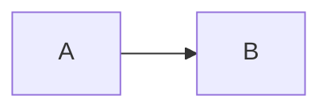

# Jainish Patel — Research Studio

A personal research studio and digital publication: portfolio, research lab, interactive biography and a real, database-backed blog with a full admin CMS. It runs entirely locally on **Next.js + Prisma + SQLite**. External services (GitHub, Spotify, YouTube) are optional extras.

```
Browser ─▶ Next.js 16 (App Router, Server Actions, Route Handlers) ─▶ Prisma 7 ─▶ SQLite (data/portfolio.db)
                         │
                         ├─ optional ─▶ GitHub API   (widget, cached in SQLite)
                         ├─ optional ─▶ Spotify API  (widget, demo fallback)
                         └─ optional ─▶ YouTube/Vimeo/CodePen… embeds (click-to-load)
```

---

## Quick start

Requirements: **Node 22.12+** (Node 22 LTS or 24) and npm. Prisma 7, better-sqlite3 13, Mermaid and Vitest all require it; on Node 20 the install warns `EBADENGINE` and the native SQLite driver will not build. With nvm: `nvm install 22 && nvm use 22` (an `.nvmrc` is included).

```bash
npm install                 # also runs `prisma generate`
cp .env.example .env        # then set SESSION_SECRET and ADMIN_PASSWORD
npm run setup               # migrate → generate → seed (creates data/portfolio.db)
npm run dev                 # http://localhost:3000
```

Sign in at **`/admin`** with `ADMIN_EMAIL` / `ADMIN_PASSWORD` from `.env`. If `ADMIN_PASSWORD` is empty, the seed generates a random password and prints it once.

Generate a session secret with:

```bash
node -e "console.log(require('crypto').randomBytes(32).toString('hex'))"
```

### Database scripts

| Script | What it does |
| --- | --- |
| `npm run db:migrate` | `prisma migrate dev`: create and apply a migration after editing `schema.prisma` |
| `npm run db:deploy` | `prisma migrate deploy`: apply existing migrations (CI / production) |
| `npm run db:generate` | `prisma generate`: regenerate the typed client into `src/generated/prisma` |
| `npm run db:seed` | Wipe content tables and reseed (`-- --no-demo` skips demo comments, likes and views) |
| `npm run db:studio` | Prisma Studio: browse the SQLite file |
| `npm run db:reset` | Drop, re-migrate and reseed (development only) |

The seed **refuses to run when `NODE_ENV=production`** unless you pass `--force`.

---

## Environment variables

| Variable | Required | Purpose |
| --- | --- | --- |
| `DATABASE_URL` | yes | SQLite file, default `file:./data/portfolio.db` |
| `NEXT_PUBLIC_SITE_URL` | yes in prod | Canonical origin for SEO, sitemap, RSS and OpenGraph |
| `SESSION_SECRET` | yes in prod (≥ 32 chars) | Signs anonymous visitor IDs and salts IP hashes. Production refuses to start without it. |
| `ADMIN_EMAIL` | seed only | Admin account email |
| `ADMIN_PASSWORD` | seed only | Admin password (≥ 12 chars). If empty, a random one is printed once. |
| `ADMIN_NAME` | seed only | Display name for the author |
| `GITHUB_USERNAME` | optional | Defaults to `jainish1510` |
| `GITHUB_TOKEN` | optional | Raises rate limits and enables the real contribution calendar (needs no scopes) |
| `SPOTIFY_CLIENT_ID` / `SPOTIFY_CLIENT_SECRET` / `SPOTIFY_REFRESH_TOKEN` | optional | Live "now playing". Without them the widget shows a demo track with a visible **demo data** badge. |
| `UPLOAD_DIR` | optional | Where uploads are stored, default `data/uploads` |

No credentials are committed. `.env` and `data/` are git-ignored.

---

## What's inside

### Public site
| Route | |
| --- | --- |
| `/` | Cinematic hero with a WebGL constellation (mouse parallax, scroll dolly, reduced-motion and no-WebGL SVG fallback), "Currently", featured projects, research, writing, about, contact |
| `/about` | Story, interactive journey timeline, education, experience, recognition, interests, goals, and widgets: Spotify, GitHub, local clock, random fact, currently learning, orbiting favorite tools |
| `/projects`, `/projects/[slug]` | Filterable explorer (ALL / ML / RESEARCH / WEB / CLOUD / AI / SYSTEMS) with depth-on-hover cards. Detail pages cover problem, motivation, architecture (Mermaid), how it works, challenges, results, lessons, gallery and demo. |
| `/research`, `/research/[slug]` | Interactive force-directed research graph (click an area to filter related research, projects, writing and technologies) plus academic-style entries |
| `/experience` | Scroll-driven career timeline and the **technology universe** (bubble size = real usage) |
| `/blog`, `/blog/[slug]` | Publication index (featured, recent, most read, categories, tags, search) and the reading experience described below |
| `/search` | Full search page; `⌘K` / `Ctrl K` anywhere opens the command palette |
| `/bookmarks` | Saved articles (local + server, no account) |
| `/contact` | Contact form (stored in SQLite, shown in admin) |
| `/rss.xml`, `/sitemap.xml`, `/robots.txt` | Feeds and SEO |

**Article pages** include a sticky reading-progress bar, a live table of contents, "continue reading" (localStorage), a sticky engagement bar (like, comment, save, share), KaTeX math, highlighted code with copy buttons, an image lightbox with arrow-key paging, click-to-load video embeds, lazily rendered Mermaid, interactive components, related articles, previous/next navigation, and threaded comments (max 3 levels) with likes.

### Admin CMS (`/admin`)
- **Dashboard**: posts, drafts, views, comments, likes, bookmarks, a 30-day chart, the moderation queue and recent posts
- **Posts**: filter, search and sort. The **editor** offers write / split / preview modes with live preview, a formatting toolbar, paste/drop image upload, a media picker, an embed dialog, an interactive-component inserter, autosave for drafts, local crash backup, revisions with restore, a publish checklist, scheduled publishing, SEO fields and a full-page preview.
- **Comments**: pending / approved / spam / rejected, bulk actions, post filter, author replies
- **Media library**: upload, preview, alt text, captions, folders (Blog / Projects / Research / Profile / Misc), dimensions, usage counts, copy-as-markdown
- **Content**: one schema-driven manager for projects, research, experience, education, awards, skills, research areas, the "Currently" rows, journey, learning, facts, books, interests, goals and social links
- **Tags & categories**, **Analytics** (views, likes and comments over time, most-read posts, referrers, devices, popular tags, project clicks, 7/30/90-day ranges, table view), **Messages**, **Widgets**, **Site settings** (identity, homepage sections, About copy, contact, navigation)

Normal content never requires a code change.

---

## Writing posts

Posts are stored as Markdown (with extensions) in SQLite, never hard-coded in components.

````markdown
## Headings, **bold**, *italic*, ++underline++, `code`, [links](https://…)

> Blockquotes, lists, tables (GFM), footnotes[^1]

Inline math $E = mc^2$ and display math:

$$
\mathcal{L} = \mathbb{E}_{q}[\log p(x \mid z)] - D_{KL}(q \,\|\, p)
$$

```python
print("syntax highlighted, with a copy button")
```




:::gallery


:::

::youtube[Caption]{id="aircAruvnKk"}
::video[Caption]{src="/media/blog/clip.mp4"}
::embed[Caption]{url="https://codepen.io/user/pen/abc"}

:::callout{kind="note" title="Heads up"}
Callouts: note, tip, warning, demo.
:::

::component[Optional title]{name="gaussian-explorer" mu="1.2"}
````

**Interactive components** are registered in `src/components/content/component-slot.tsx`. Each is code-split, so a post only loads the components it uses. Bundled ones: `gaussian-explorer`, `sorting-visualizer`, `line-chart`, `uncertainty-sim`. Adding a Plotly chart or a custom demo means adding one file and one registry line.

---

## Architecture

```
prisma/
  schema.prisma          relational schema (User, Post, PostRevision, Tag, Category, Media,
                         Comment, CommentLike, Like, Bookmark, View, Event, Project,
                         ResearchProject, ResearchArea, Experience, Education, Award, Skill,
                         SocialLink, PersonalWidget, NowItem, TimelineEvent, …)
  migrations/            SQL migrations
  seed.ts, seed-art.ts   seed data + generative cover art (rendered with sharp)
  seed-content/*.md      demonstration articles
src/
  app/(public)/          public routes (route groups keep skeletons off detail pages so 404s are real)
  app/admin/             login, (panel)/ protected pages, actions/ (server actions)
  app/api/               JSON route handlers (search, engagement, comments, uploads, health…)
  app/media/[...path]    serves uploads with range requests and a sandboxed CSP
  components/            ui/, blog/, content/, portfolio/, research/, three/, widgets/, admin/, interaction/
  lib/db                 Prisma client (the only SQLite-specific file)
  lib/repositories       Repository pattern: posts, comments, engagement, media, portfolio, analytics, collections
  lib/integrations       Adapter pattern: GitHub, Spotify (live + demo provider)
  lib/content            Markdown pipeline, directives, embed factory, editor operations
  lib/search             in-process weighted search index
  lib/events             typed event bus (Observer): publish → revalidate pages, refresh search
  lib/admin              declarative collection definitions → generated validators and forms (Factory)
  lib/security           rate limiting, visitor IDs, spam scoring, request helpers
tests/
  unit/ integration/ e2e/
```

**Design patterns, where they earn their place:**
- **Repository** for all database access (`src/lib/repositories`)
- **Adapter** for external APIs (`MusicProvider` with a Spotify and a demo implementation, a normalized GitHub snapshot, embed providers)
- **Strategy** for 3D rendering quality (`render-strategy.ts` picks full / lite / static per device)
- **Observer** via the event bus (publishing triggers revalidation and search-index refresh)
- **Factory** for embeds (`createEmbed`) and admin collections (field definitions → zod schemas → forms)

### Moving off SQLite
Enumerations are strings validated in the app, and JSON is avoided except for small widget configs. To move to PostgreSQL or Turso:
1. Change `provider` in `schema.prisma` to `postgresql` (or keep `sqlite` for libSQL).
2. Swap `@prisma/adapter-better-sqlite3` for `@prisma/adapter-pg` / `@prisma/adapter-libsql` in `src/lib/db/client.ts`.
3. Regenerate migrations. Uploads in `data/uploads` would move to object storage behind `src/lib/media/storage.ts`.

---

## Security

- **Admin authentication**: scrypt password hashing. Opaque random session tokens are kept in an `httpOnly`, `SameSite=Lax` (Secure in production) cookie, and only the token's SHA-256 is stored. Sessions expire after 7 days and logout revokes them. Login is rate-limited in memory and in the database (failures persist across restarts), and the comparison is constant-time even for unknown emails.
- **Authorization**: `src/proxy.ts` gives an early redirect, and `requireAdmin()` is the real check on every admin page, server action and admin route handler.
- **CSRF**: Server Actions get Next.js's origin check. JSON mutation endpoints verify `Origin` against `Host`.
- **XSS**: Markdown is sanitized with `rehype-sanitize` *before* KaTeX and highlighting run, and raw HTML is never parsed. Comments are plain text (control and bidi characters stripped) and rendered by React. Mermaid runs with `securityLevel: "strict"`. JSON-LD escapes `<`.
- **Uploads**: types are detected from magic bytes (PNG, JPEG, WebP, GIF, AVIF, MP4, WebM; **no SVG**), with a 12 MB cap and random filenames. Path traversal is refused, and media is served with `nosniff` and a sandboxed CSP.
- **Abuse controls**: per-IP rate limits on search, likes, bookmarks, views, comments, contact and uploads. Comments also get a honeypot, a minimum time-to-submit, length limits, spam scoring and a moderation queue.
- **Privacy**: anonymous visitor IDs are HMAC-signed cookies, IPs are stored only as salted hashes, referrers only as hostnames, and bots are excluded from view counts.
- **Headers**: CSP, `X-Content-Type-Options`, `Referrer-Policy`, `X-Frame-Options`, `Permissions-Policy`, and HSTS in production. Admin pages are `noindex`.

`npm audit` reports advisories in `mysql2`, a transitive dependency of the Prisma CLI. It is development tooling that this app never loads (SQLite only).

---

## Testing

```bash
npm run typecheck
npm test                    # Vitest: unit + integration (fresh SQLite at data/test.db)
npm run test:e2e            # Playwright: isolated data/e2e.db on port 3100
```

- **Unit**: Markdown pipeline (XSS, math, directives, TOC), embeds, text utilities, search ranking/typos/AND semantics, validation, collection-schema factory, editor operations, password hashing, visitor-ID signing, rate limiting, spam scoring, upload detection, path traversal
- **Integration** (real SQLite): create/edit/publish/schedule/archive posts, revisions, tags, slugs, related posts, search visibility, likes (including concurrent duplicates), view de-duplication, bookmarks, comment moderation and depth cap, sessions, generic collections, settings, media upload
- **E2E**: login (wrong then right password) → create post → toolbar + live preview → tags/category → save draft → draft is a real 404 → full preview → publish confirmation → public article → like persists → save → comment → moderate → comment visible → bookmarks → search → logout. There are also public smoke tests on desktop and mobile viewports.

If Playwright's browser download is blocked, point it at an installed Chromium with `PW_CHROMIUM_PATH=/path/to/chrome npm run test:e2e`.

---

## Deployment

This is a **Node.js server application** (SQLite, server actions, uploads). It cannot run on static hosts such as **GitHub Pages**, which this repository was originally configured for. Deploy it anywhere with a persistent disk and Node 22.12+, such as a VPS, Fly.io (with a volume), Railway or Render:

```bash
npm ci
npm run db:deploy && npm run db:generate
npm run db:seed -- --no-demo   # first deploy only; requires ADMIN_PASSWORD
npm run build && npm start
```

Back up `data/` (database + uploads). On serverless platforms without a persistent disk, use Turso/libSQL or Postgres (see above) and object storage for uploads.

### Spotify refresh token
1. Create an app at developer.spotify.com and add a redirect URI.
2. Authorize once with scopes `user-read-currently-playing user-read-recently-played`.
3. Exchange the code for tokens and put the `refresh_token` in `.env`.

---

## Content provenance

- **Real profile data** (education, roles, projects, recognitions, links) comes from the CV data in this repository before the rebuild (`data/cvData.ts`). Specific claims such as "5K+ scans" or "ROUGE +21%" are copied from that source.
- Anything not in that source is marked: projects and research show **"details pending" / "placeholder"** badges, settings and goals carry `[Placeholder]` text, and the portrait is an abstract placeholder.
- The five blog posts, all comments by "(demo)" readers, and the seeded likes, views and bookmarks are **demonstration content** and are labeled that way on the site. Clear them with `npm run db:seed -- --no-demo` or delete them in the admin.
- No publications, awards or employment were invented.

---

## Small delights

- `⌘K` / `Ctrl K` command palette · `/` search · `?` (`Shift + /`) keyboard shortcuts · `G` then `H/A/P/R/B/E/S` to navigate · `T` toggles the theme
- Type `sudo` in the palette for **developer mode** (WebGL, API, database status)
- The Konami code unlocks a hidden note
- Every cover image is generated from code, seeded by its slug
