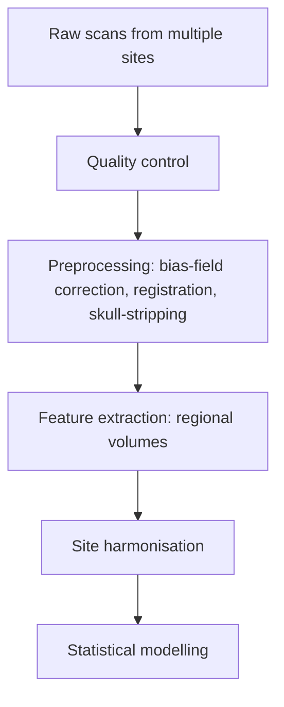

:::callout{kind="demo" title="Demonstration article"}
Study notes generated to demonstrate the publishing system. They summarise standard concepts; the personal context reflects work listed on the Experience page.
:::

Moving from general machine learning into medical imaging, the first surprise is how little of the work is modelling. Most of it is understanding the data — what the scanner actually measured, and what changed between sites.

## Images are measurements, not pictures

A photo is a grid of colours. An MRI volume is a grid of **measurements in physical space**. Each voxel has a size (often anisotropic, e.g. $1 \times 1 \times 3$ mm), and an affine matrix maps voxel indices to scanner coordinates:

$$
\begin{bmatrix} x \\ y \\ z \\ 1 \end{bmatrix} = A \begin{bmatrix} i \\ j \\ k \\ 1 \end{bmatrix}
$$

Ignore the affine and you will happily compare a left hemisphere with a right one.

```python
import nibabel as nib
import numpy as np

img = nib.load("sub-01_T1w.nii.gz")
data = img.get_fdata(dtype=np.float32)
print(data.shape)                  # (i, j, k)
print(img.header.get_zooms())      # voxel size in mm
print(nib.aff2axcodes(img.affine)) # orientation, e.g. ('R', 'A', 'S')
```

## File formats

| Format | Typical use | Notes |
| --- | --- | --- |
| DICOM | Scanner output, clinical systems | One file per slice, rich (and identifying) metadata |
| NIfTI | Research pipelines | One file per volume, affine in the header |
| BIDS | Dataset organisation | A folder convention, not a file format |

## Intensity is not standardised

MRI intensities have no absolute units. The same tissue can have different values on two scanners — or on the same scanner on different days. A common first step is per-volume z-scoring within a brain mask:

$$
\tilde{x}_v = \frac{x_v - \mu_{\text{mask}}}{\sigma_{\text{mask}}}
$$

## Site effects

In multicenter studies, *where* a scan was acquired can explain more variance than the biology you care about. Scanner vendor, field strength and protocol all leave fingerprints. Harmonisation methods such as **ComBat** model each site's additive and multiplicative effect and remove it while preserving covariates of interest.



Working on automated MRI analysis pipelines made one lesson concrete: **reproducibility is a data-engineering problem first.** Version every preprocessing step, record every parameter, and assume that someone — probably you — will need to rerun everything in six months.

## Things I'm still learning

- fMRI and the difference between structural and functional analysis
- Registration methods and how their errors propagate downstream
- Evaluation metrics that clinicians actually trust

*[Placeholder: extend these notes with references and figures from your own work.]*
