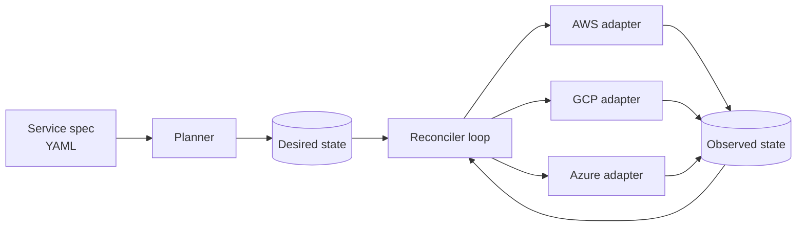

:::callout{kind="demo" title="Demonstration article"}
This post was generated to demonstrate the publishing system — headings, code, diagrams, tables and callouts. The engineering ideas are real; any specific numbers are placeholders to be replaced with measured results.
:::

Every cloud provider wants to be the only one you use. Their SDKs, their IAM models, their naming conventions — all of it quietly assumes you will never leave. A **multi-cloud deployment orchestrator** is a tool that refuses that assumption: you describe *what* should run, and it decides *where* and *how* across AWS, Google Cloud and Azure.

This is a write-up of the design decisions that mattered most while building one, and the ones I would make differently.

## The problem, stated precisely

The goal was never "deploy to three clouds". It was:

1. A single declarative spec for a service (image, resources, regions, scaling policy).
2. A planner that maps that spec onto concrete provider resources.
3. A reconciler that drives real infrastructure toward the plan — and keeps it there.

> The interesting part of infrastructure is never the happy path. It is what happens when step 7 of 12 fails and you have to decide whether the world is now in state 6, 7, or somewhere new.

## Architecture



The key idea is borrowed from Kubernetes controllers: **never execute a script, always converge a diff**. The reconciler repeatedly compares desired state with observed state and issues the smallest set of actions that closes the gap.

## One interface, many providers

Each cloud sits behind the same adapter interface. The planner never imports a provider SDK.

```ts
export interface ProviderAdapter {
  readonly name: "aws" | "gcp" | "azure";
  /** Read what actually exists — never trust our own records alone. */
  observe(service: ServiceRef): Promise<ObservedState>;
  /** Apply a single idempotent action. Safe to retry. */
  apply(action: Action): Promise<ActionResult>;
  /** Rough monthly cost for a placement, used by the planner. */
  estimate(placement: Placement): Promise<Money>;
}

export async function reconcile(desired: DesiredState, adapters: ProviderAdapter[]) {
  for (const adapter of adapters) {
    const observed = await adapter.observe(desired.service);
    for (const action of diff(desired.for(adapter.name), observed)) {
      await withRetry(() => adapter.apply(action), { attempts: 4, backoff: "exponential" });
    }
  }
}
```

Two properties carry the whole design:

- **Idempotency.** Every `apply` can run twice without harm. Creating a bucket that exists is a no-op, not an error.
- **Observation over memory.** The orchestrator's own database is a cache. The cloud is the source of truth.

## Choosing where to run

The planner scores each candidate placement. A simple weighted objective was enough:

$$
\text{score}(p) = w_c \cdot \frac{1}{\text{cost}(p)} + w_l \cdot \frac{1}{\text{latency}(p)} + w_r \cdot \text{redundancy}(p)
$$

The weights come from the service spec, so a batch job can say "cheapest wins" while an API says "latency first".

| Concern | Where it lives | Why |
| --- | --- | --- |
| Credentials | Provider adapter | Never leaves the boundary that needs it |
| Retry policy | Reconciler | Uniform behaviour across clouds |
| Cost model | Adapter `estimate()` | Pricing is provider-specific |
| Desired state | SQLite → Postgres | Small, relational, auditable |

## What went wrong

**Eventual consistency everywhere.** A resource created a second ago may not appear in a list call yet. The fix was to make `observe` tolerant: a missing resource that we *just* created is "pending", not "absent".

**Partial failure.** Halfway through a rollout, one region fails. Rolling everything back is often worse than leaving the healthy regions up. The reconciler now treats each region as an independent unit of convergence.

**Naming.** Every provider has different rules for resource names (length, characters, uniqueness scope). A single `nameFor(provider, logicalName)` function saved a surprising number of bugs.

## Lessons

- Treat infrastructure as a *control loop*, not a script.
- Put provider differences behind an interface early — before the second provider, not after the third.
- Make every action idempotent, then retries become free.
- Measure. *[Placeholder: add real deployment times and failure-recovery numbers here.]*
