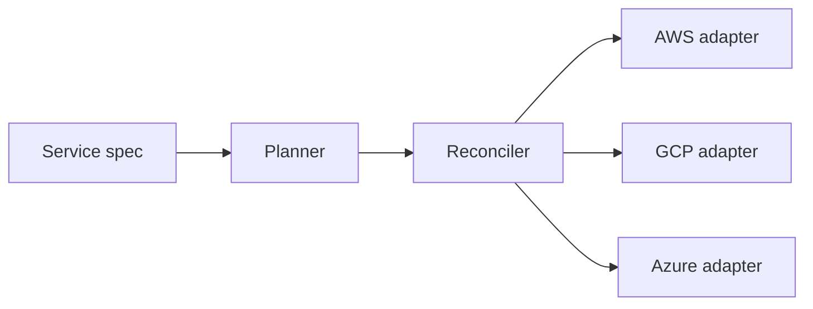

# Problem

Cloud SDKs assume you will only ever use one provider. Deploying the same service to several clouds means re-learning IAM, naming rules and failure modes for each.

# Why I built it

I wanted to understand infrastructure as a *control loop* — desired state, observed state, and the smallest set of actions that closes the gap.

# Architecture

Each provider implements the same `ProviderAdapter` interface: `observe`, `apply` and `estimate`.

# How it works

The planner scores candidate placements on cost, latency and redundancy. The reconciler repeatedly diffs desired and observed state and applies idempotent actions with retries.

# Challenges

- Eventual consistency in provider list APIs
- Partial failures mid-rollout
- Provider-specific naming constraints

# Results

[Placeholder] Add measured deployment times, supported services and test coverage.

# Lessons

Make every action idempotent and retries become free. Put provider differences behind an interface before the second provider, not after the third.
