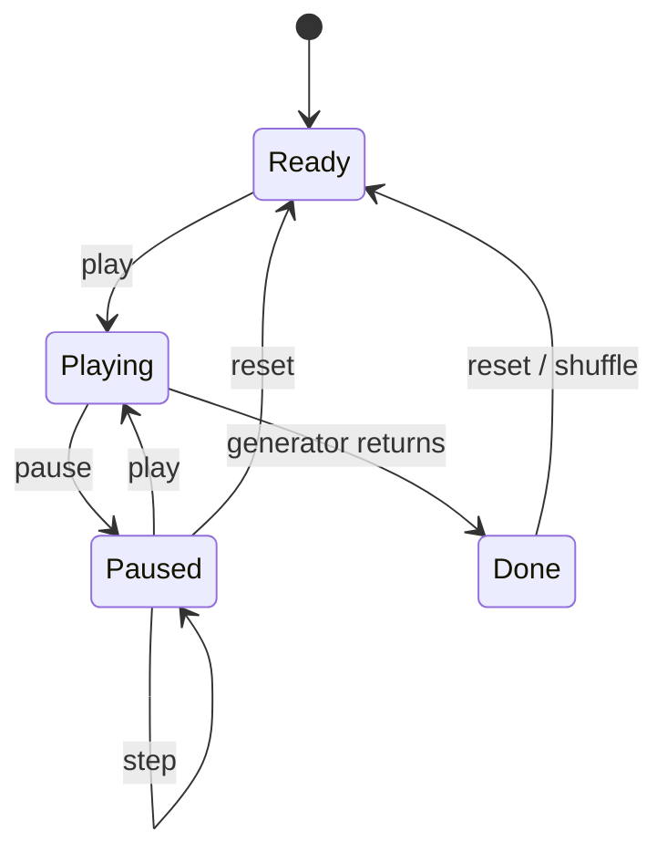

:::callout{kind="demo" title="Demonstration article"}
Generated to demonstrate interactive components, image galleries, Mermaid diagrams and code. The approach described is the one used by the visualizer embedded below.
:::

Algorithm visualizations usually fail in one of two ways: they are pretty but you cannot control them, or controllable but disconnected from real code. The design below avoids both by making **the algorithm itself the source of every frame**.

## The core idea: algorithms as generators

Write each algorithm once, as a generator that *yields* its state whenever something interesting happens. The UI just pulls frames.

```ts
type Frame = { values: number[]; compare?: [number, number]; label: string };

function* insertionSort(input: number[]): Generator<Frame> {
  const a = [...input];
  for (let i = 1; i < a.length; i++) {
    let j = i;
    while (j > 0 && a[j - 1] > a[j]) {
      yield { values: [...a], compare: [j - 1, j], label: `shift ${a[j]} left` };
      [a[j - 1], a[j]] = [a[j], a[j - 1]];
      j--;
    }
  }
  yield { values: a, label: "sorted" };
}
```

Play, pause, single-step and scrubbing all fall out for free: *play* calls `next()` on a timer, *step* calls it once, and *reset* creates a fresh generator.

::component[Try it — the same generator pattern, live]{name="sorting-visualizer" algorithm="insertion" size="22"}

## The playback state machine



Keeping this explicit avoids the classic bugs — double timers, stepping after completion, resetting mid-frame.

## Visual encoding

A few rules made the difference between "animated bars" and something you can actually learn from:

1. **Colour encodes role, not decoration.** Warm for the elements being compared, accent for the sorted region, neutral for everything else.
2. **One change per frame.** If two things move at once, the eye follows neither.
3. **Show the counter.** The number of steps is the complexity analysis, made visible.

:::gallery


:::

## Comparing algorithms honestly

| Algorithm | Best | Average | Worst | Stable |
| --- | --- | --- | --- | --- |
| Insertion sort | $O(n)$ | $O(n^2)$ | $O(n^2)$ | Yes |
| Bubble sort | $O(n)$ | $O(n^2)$ | $O(n^2)$ | Yes |
| Merge sort | $O(n \log n)$ | $O(n \log n)$ | $O(n \log n)$ | Yes |

Run insertion sort on a nearly-sorted array and it finishes in a handful of steps — the visualization makes the $O(n)$ best case *felt* rather than memorised.

## What's next

- Graph algorithms (BFS/DFS, Dijkstra) using the same frame protocol
- A WebGL renderer for arrays large enough that SVG starts to struggle
- Side-by-side races between algorithms on identical inputs
